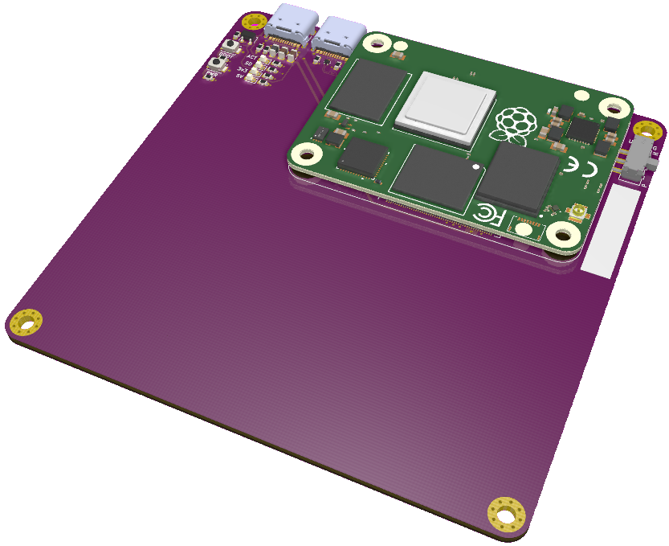

# cm4-carriers

## About

This repository contains various Raspberry Pi Compute Module 4 (CM4) carrier boards designed with specific applications in mind.

It also contains "template" boards from which application-specific boards can be quickly derived.

## Boards

### `hardware/cm4-carrier-template`

#### About
A 90mm x 90mm carrier board that can be used as a basis for application-specific boards.

This board can also be used to program the eMMC memory for use on other carrier boards.

#### Features
* Independent power and data USB 2.0 connectors (Type-C)

### `hardware/cm4-carrier-net`

#### About
A 40mm x 90mm carrier board that provides the CM4 with a Gigabit Ethernet interface.

This board can also be used to program the eMMC memory for use on other carrier boards.

#### Features
* Gigabit Ethernet
* USB 2.0 shared power and data connector (Type-C)
* Micro SD card slot

## Donate

Please consider supporting this project and others like it by donating:

* ☕: [ko-fi.com/jkiv_](https://ko-fi.com/jkiv_)
* ₿: `13zRrs1YDdooUN5WtfXRSDn8KnJdok4qG9`
